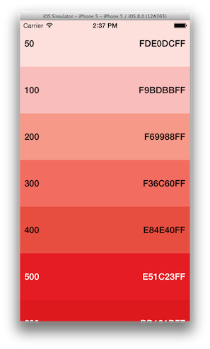

MaterialDesignColorsSwift
===

Or [Google Material Design Color](http://www.google.com/design/spec/style/color.html) for **Swift**

This library contains all colors defined in Google guidelines for Material design using a set of struct constraints.

Included with this library there are a NSColor/UIColor initializer for converting Hex to Colors.

In the *Script* folder there is a script written in python which can be used to parse the Google website linked above and produce a list of struct with colors. It's manly for internal use but feel free to do whatever you want with it. (*Note: Text colors are taken from css file*)

###Usage

	// iOS
	var myColor = UIColor(rgba: MaterialColors.Red.P500.HUE))
	var myTextColor = UIColor(rgba: MaterialColors.Red.P500.TEXT))
	
	// OSX
	var myColor = NSColor(rgba: MaterialColors.Red.P500.HUE))
	var myTextColor = NSColor(rgba: MaterialColors.Red.P500.TEXT))

###Note

This library is written in Swift and (should be) compatible with OSX and iOS development but I am not using Yosemite yet so feedbacks are welcome.

###License
This code is distributed under the terms and conditions of the [MIT license](LICENSE). 